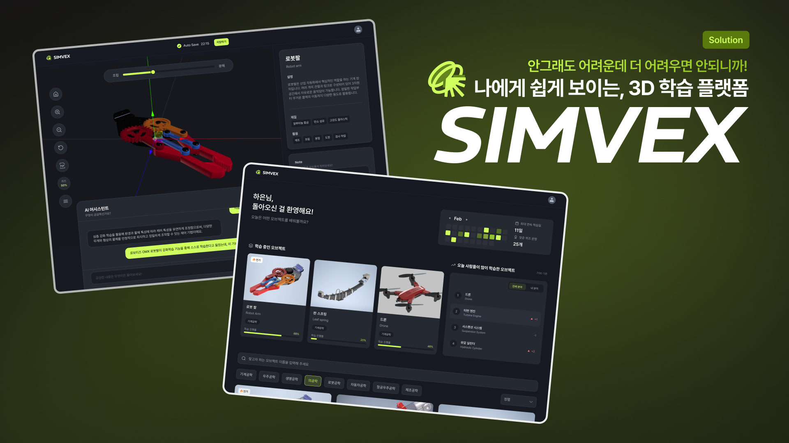

# SIMVEX



**배포 링크**: [https://frontend-two-gold-95.vercel.app/](https://frontend-two-gold-95.vercel.app/)

> 나에게 쉽게 보이는, 3D 학습 플랫폼 SIMVEX

공학 학습과 연구를 하나로 잇는 3D 시각화·시뮬레이션 플랫폼입니다. 3D 모델을 인터랙티브하게 탐색하고, AI 어시스턴트와 함께 학습하며, 퀴즈로 이해도를 확인할 수 있습니다.

---

## 주요 기능

### 홈 (`/home`)
- **환영 메시지**: 로그인 사용자 이름 기반 환영 문구
- **잔디 섹션**: 학습 연속일·퀴즈 풀이 기록 시각화
- **학습 중인 오브젝트**: 사용자가 학습 중인 3D 모델 목록
- **랭킹**: 오늘 사람들이 많이 학습한 오브젝트 순위
- **오브젝트 목록**: 검색, 카테고리, 정렬, 페이지네이션으로 전체 오브젝트 탐색

### 로그인 (`/login`)
- **Credentials 로그인**: 아이디/비밀번호로 인증
- **온보딩 연동**: 최초 로그인 시 온보딩 페이지로 이동

### 온보딩 (`/onboard`)
- **4단계 설정**: 이름, 학습 분야·레벨, 전문 분야, 색상 테마·AI 페르소나
- **취향 반영**: AI 튜터가 사용자 맞춤형 설명 제공

### 3D 뷰어 (`/viewer/[objectName]`)
- **3D 모델 렌더링**: Three.js(R3F) 기반 GLTF/GLB 모델 표시
- **조립/분해 슬라이더**: 0~100%로 부품 분해도 조절
- **부품 선택**: 클릭·부품 리스트로 특정 부품 선택 및 포커스
- **객체 정보 패널**: 선택된 부품/제품의 설명, 재질, 활용 표시
- **메모(Note)**: 마크다운 에디터, `/` 명령 메뉴, `@` 부품 멘션
- **AI 어시스턴트**: 질문/답변, `@` 부품 멘션으로 맥락 제공
- **퀴즈**: SELECT/INPUT 유형, 진행률·오답 복습
- **PDF 출력**: 총정리 PDF + 노트 PDF, 스크린샷 모드(전체/현재)
- **자동 저장**: 10초마다 씬 상태·분해도·노트 저장

---

## 기술 스택

| 구분 | 기술 |
|------|------|
| 프레임워크 | Next.js 16, React 19 |
| 인증 | NextAuth.js (Credentials) |
| 3D | Three.js, React Three Fiber, Drei |
| 에디터 | TipTap (ProseMirror) |
| PDF | jsPDF, html2canvas |
| 스타일 | Tailwind CSS |
| 패키지 매니저 | pnpm (권장) |

---

## 프로젝트 구조

```
app/
├── (main)/               # 메인 레이아웃 (네비게이션 바)
│   ├── home/             # 홈 페이지
│   ├── login/            # 로그인
│   ├── onboard/          # 온보딩
│   └── viewer/[objectName]/  # 3D 뷰어
├── _components/          # 공통 컴포넌트
│   ├── 3d/               # 3D 씬 (SceneContent, 훅, 유틸)
│   ├── home/             # 홈 관련 (WelcomeSection, GrassSection 등)
│   ├── viewer/           # 뷰어 관련 (ViewerSidebar, Note, AiPanel 등)
│   └── onboard/          # 온보딩 관련
├── _contexts/            # React Context (SaveStatus 등)
├── _hooks/               # 커스텀 훅
├── _types/                # 타입 정의
└── api/                  # API 라우트
```

---

## 팀원

| [](https://github.com/nacong) | [](https://github.com/dowankim1024) |
|:--:|:--:|
| [**Nabeen Yang**](https://github.com/nacong) | [**DowanKim**](https://github.com/dowankim1024) |
| [@nacong](https://github.com/nacong) | [@dowankim1024](https://github.com/dowankim1024) |
| [GitBook](https://nacong.gitbook.io/nacong-docs) | [Portfolio](https://dowankim.site/) |

---

